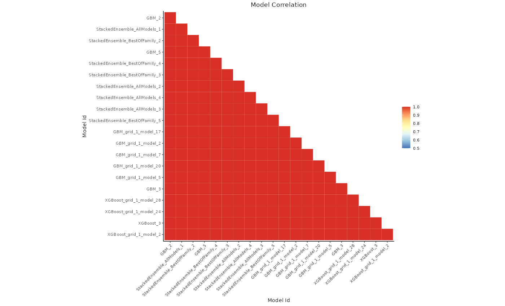
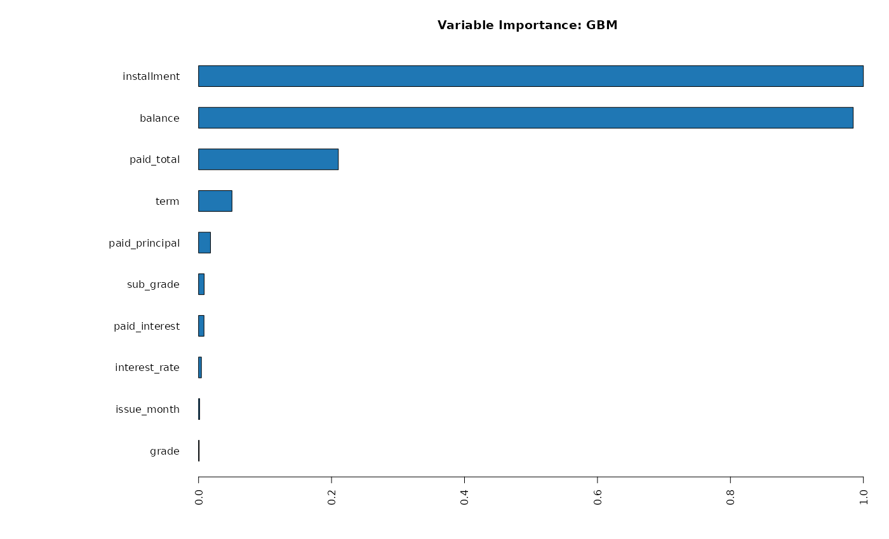
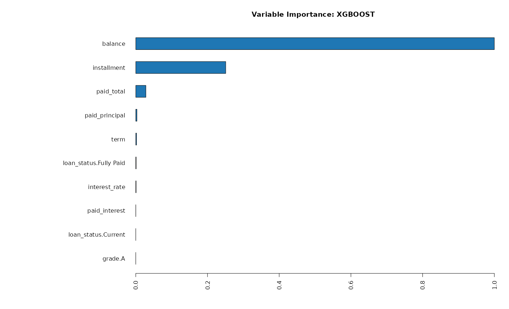
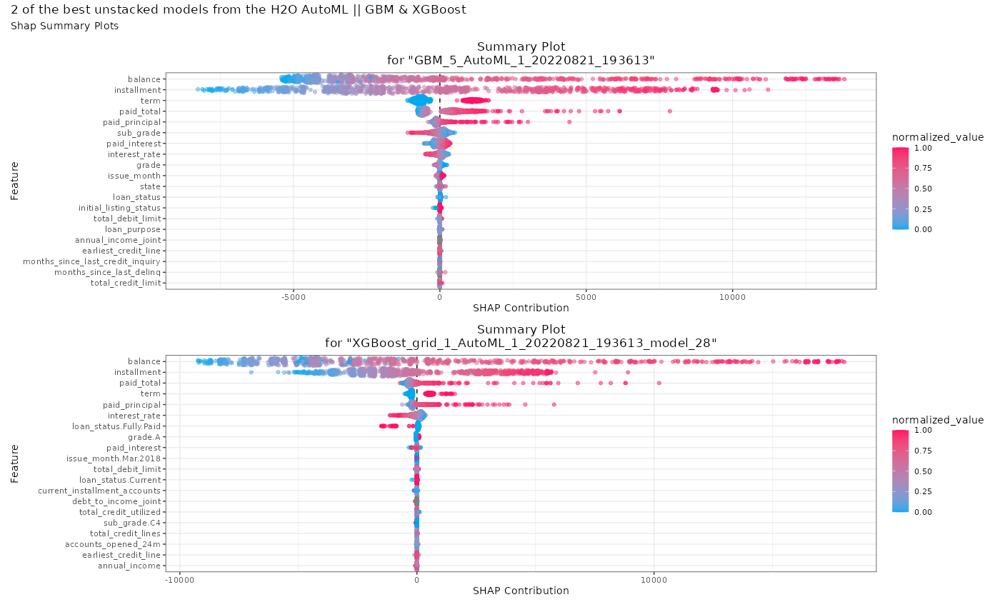
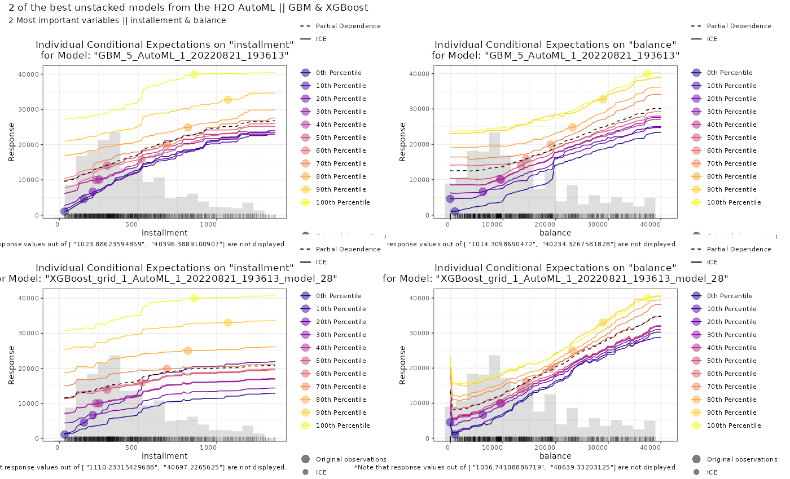

# Auto-ML -- Explainable ML

Two different modeling approaches coexist. ***Explanatory*** models are for making inferences; ***predictive*** models are for computing the value of a new or future observation when we actually did not observe the value yet.

Understanding the intended purpose of modeling is important. Data science is not only about "how to build models". "Why we build models," and "what actions/decisions should model outcomes lead to" are  crucial parts of data science use cases.

Some business problems require auto-ML, which might be particularly relevant for a good prediction as well as production. Some businesses prefer explainable-ML or explanatory models. It is all about the goals, and strategies.

This repo includes the application of auto-ML within the multi-platform H2O framework and DALEX.

Since there is increasing demand for predictive models and explainable ML, this exercise demonstrates the importance of understanding what is happening under the hood and why.

