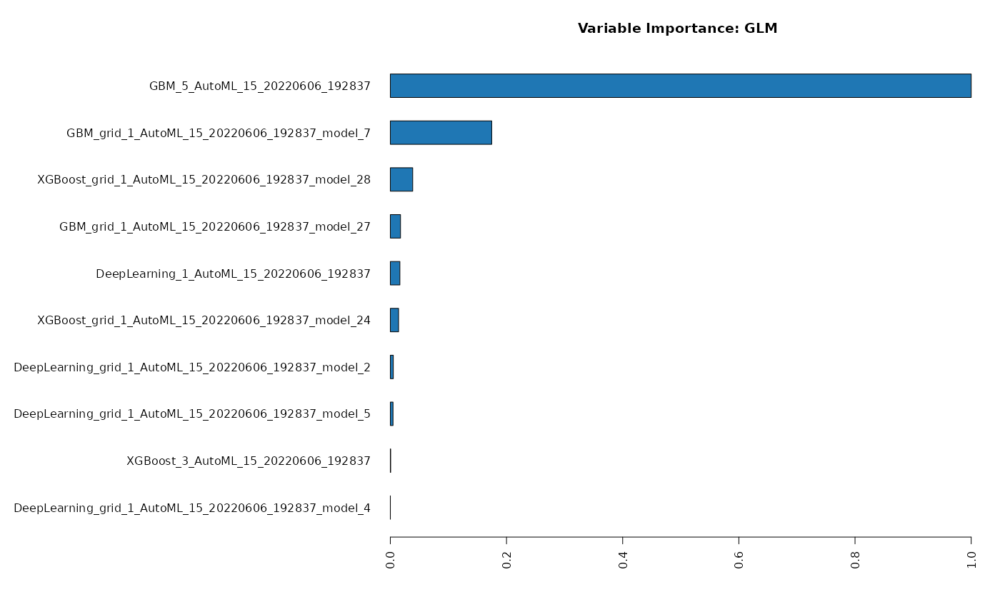
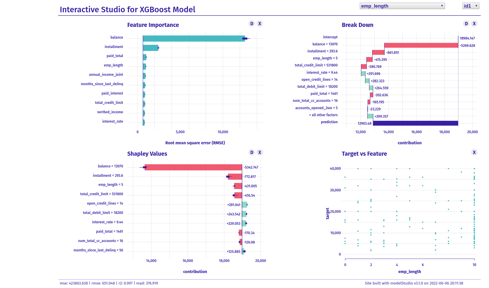

# Auto-ML -- Explainable ML

Some business problems require auto-ML (which might be particularly relevant for production); some businesses prefer explainable-ML. This choice is all about the business models, goals, and strategies.

This repo includes the application of auto-ML within the multi-platform H2O framework.

Below is the variable importance of the auto-ML outcome.

In another step, I replicate the auto-ML's model and use an explainable-ML framework to investigate to what extent auto-ML and explainable-ML are compatible.

The interactive .html for the explainable-ML is [here](mmuratardag.github.io/static/explain_ml_index.html).

In this particular regression problem, the outcomes are only somewhat similar, which is probably an artifact of
(1) having to switch from GBM to XGBoost (an incompatibility issue of a particular R library within the tidymodels ecosystem)
(2) cross-platform differences

This exercise demonstrates the importance of understanding what is happening under the hood and why.

Data science is not only about "how to build models"; "why we build models," and "what actions/decisions should model outcomes lead to" are also crucial parts of data science applications.